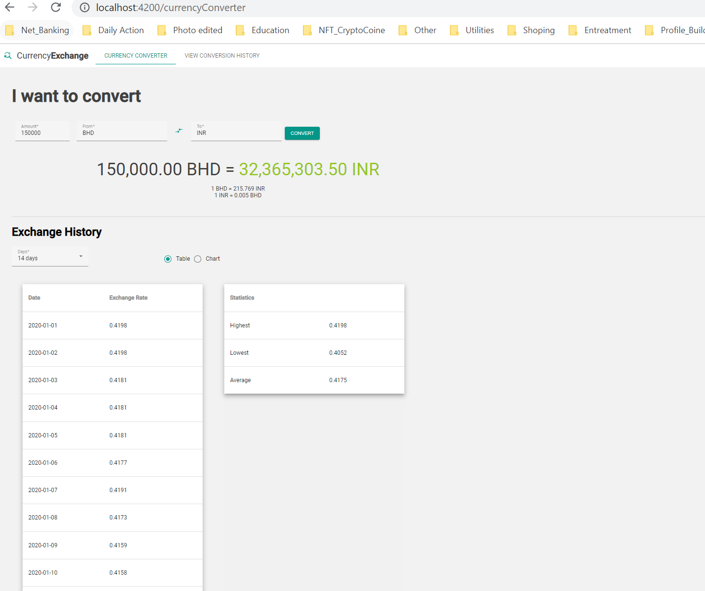
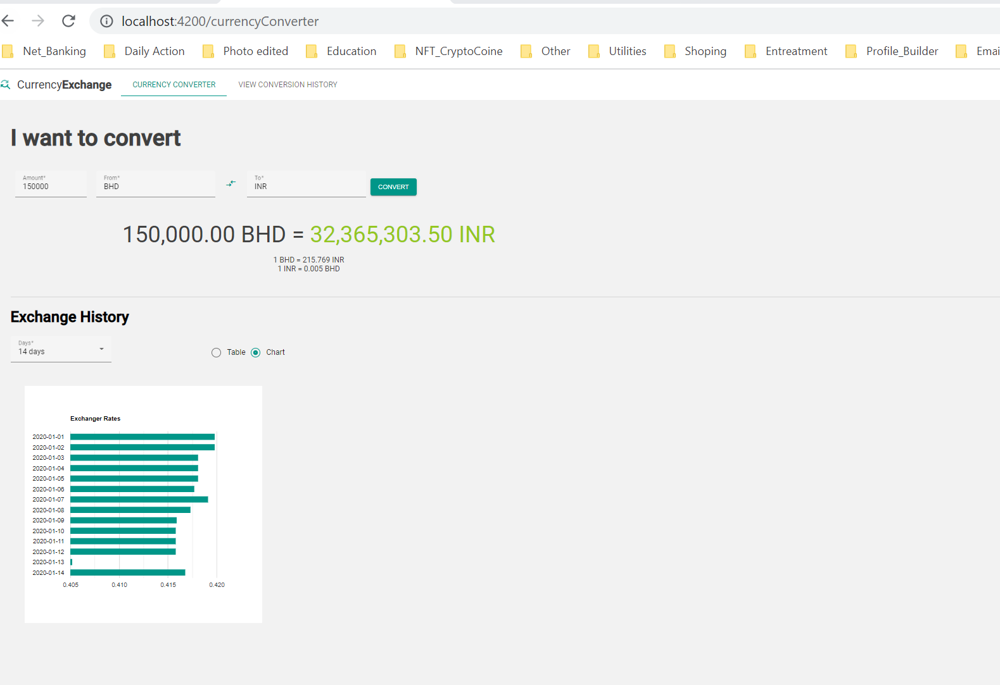
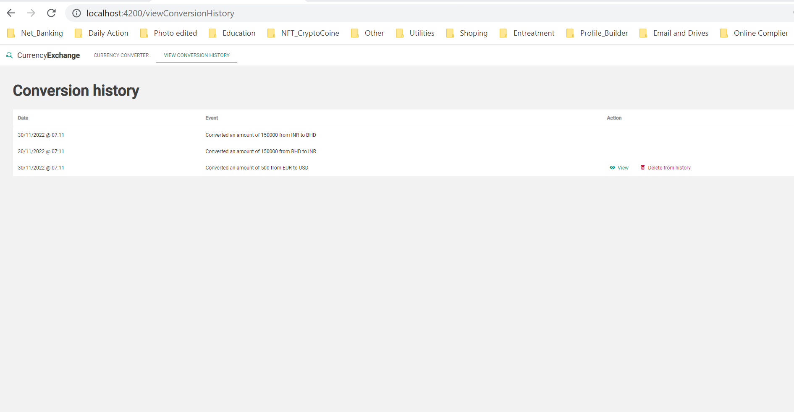

# Currnecy Exchange Application

This project was generated with Angular version 15.0.1.

## Development server

Run `ng serve` for a dev server. Navigate to `http://localhost:4200/`. The application will automatically reload if you change any of the source files.

## Build

Run `ng build` to build the project. The build artifacts will be stored in the `dist/` directory.

<h3>Screen Shots</h3>
<table>
<tr>
<td></td>
<td></td>
<td></td>
</tr>
</table>
